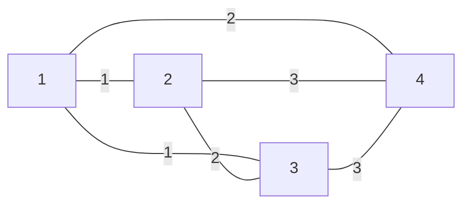

This file gives a decription of the **`lost map`** problem.

You should find the problem on Kattis :  https://open.kattis.com/problems/lostmap

**Key words** : graph problem, MST

## `Lost map` : problem description

While the problem kattis description is not that clear, the goal is simple: 

*Find a way to connect `n` villages by the most optimal road*.

The most optimal road means :

    - it must be the shortest path between the connected village.
    - it must minimize the number of roads used, meaning there doesn't need to be a direct connection between every single village.
    

This perfectly describes the **Minimum Spanning Tree** problem.


*The minimum spanning tree is a subset of the edges of a connected, edge-weighted undirected graph that connects all the vertices together.* (Source : https://en.wikipedia.org/wiki/Minimum_spanning_tree)

The previous definition implies that we need a graph. The graph needs to be **weighted**, **undirected** and **connected**.


How are we going to build it ? Let's figure it out !!!

## Connecting the dots : how to model our map.

A graph is a structure consisting of a set of objects where some pairs of the object are in some sense "related". (Source : https://en.wikipedia.org/wiki/Graph_(discrete_mathematics))


The objects are often called **node** and in this context, every node is a village.

The *"related" abstraction* is represented by **edge** and in this context, every edge is a road.

Theses **edge** could be weighted (that's what we want here), and in this context, the **edge's weights** are the **distance** between two villages.

The distances are the **input** of the problem. The first number of the first line is the **village's number** (`n`), and in a certain way, the **edge's number** of our graph.

```
4
0 1 1 2
1 0 2 3
1 2 0 3
2 3 3 0
```

The remaining `n` lines are the distance table (or distance matrix). 

**How do you read this table ?**

Every integer entry of the matrix is the distance between the `i` village and `j` village, where `i` is the row index and `j` is the column index. 

The distance values are set between $0$ and $10^7$. Additionally, every diagonal entry is zero, because the distance between the village $`i`$ and itself is zero.

This means the graph is represented as follows : 




Since every diagonal entry is non-negative, it means that the graph must be fully connected for every input matrix. 

Recall that , *a graph is said to be **connected** if there is a path between every pair of vertices* as you can see in the graph.


**How to represent the graph in my code ?**

There are multiple way to represent a graph : adjacency matrix, edge list, adjacency set,etc.

But, we do actually need to explicitly build one ? No, we don't.

To solve this problem, we only need two pieces of information:

    - Distance values
    - Optimal nodes to build the road

Since distances values are already represented by the input problem matrix, we should focus on this "optimal nodes" thing.


## How to solve the problem : Minimum Spanning Tree

Now, since we got a graph,